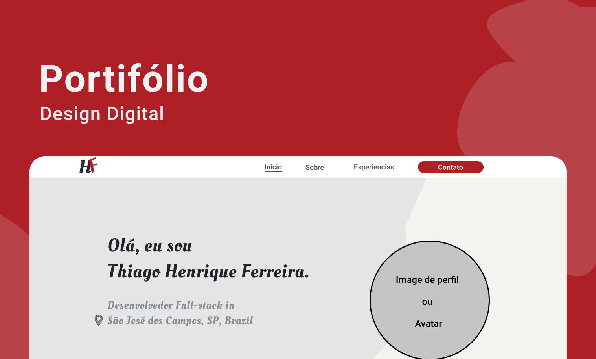

# Thiago Henrique Ferreira

#### São José dos Campos FATEC - "Professor Jessen Vidal"

### Desenvolvimento de Software Multiplataforma

> - R.A 1461392111010

 
 

## 🎨 Protótipo **Figma** - 

 

## 💻 [Protótipo Web](https://www.figma.com/proto/TGpGc2DxLaGAuE0vURIhZ9/webportifolioTh?node-id=1%3A2&scaling=contain&page-id=0%3A1)

## 📱 [Protótipo Mobile](https://www.figma.com/proto/TGpGc2DxLaGAuE0vURIhZ9/webportifolioTh?node-id=97%3A413&scaling=scale-down&page-id=97%3A60)

  
  

## 🎥 Gravações de Video

  

#### Primeira entrega:

#### Entrega final:

 
 
 

## Estrutura das pastas

| Pasta               | Definição                                                                                                              |
| ------------------- | ---------------------------------------------------------------------------------------------------------------------- |
| .github             | Imagens para o readme e futura automatização de Pull requests (PR's)                                                   |
| mgt                 | Gerenciamento. Utilizado p/ anexar o protótipo web e mobile do projeto                                                 |
| public              | Pasta pública do projeto acessível ao público geral por meio de um servidor web                                        |
| src                 | Pasta principal do projeto, não público, onde armazena-se o código fonte de cada página, pastas dentre outros arquivos |
| src/assets          | Pastas e arquivos visuais como imagens, estilização (css), componentes, etc.                                           |
| src/pages           | Código fonte das páginas do projeto                                                                                    |
| src/styles          | Estilização das páginas do projeto (futuramente migrará p/ pasta assets)                                               |
| src/styles/pages    | Pasta contendo os arquivos de estilização das páginas do projeto                                                       |
| src/styles/partials | Pasta cotendo os arquivos de estilização dos componentes do projeto como header e footer                               |
| src/styles/main.css | Arquivo de estilização _global_ do projeto, estilo como margins, fonts, cores, background, etc                         |
